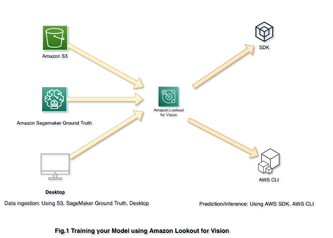
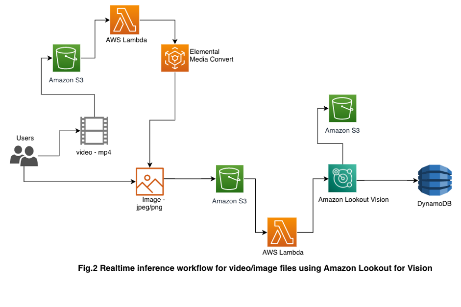
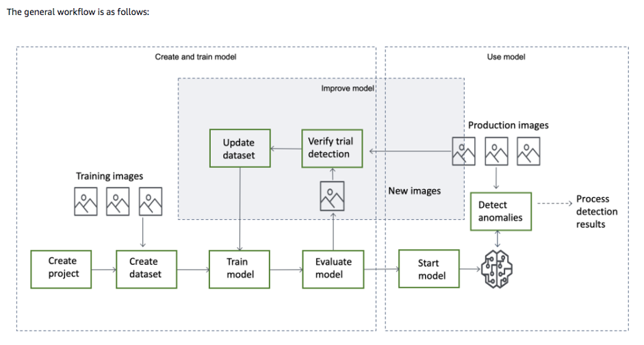

## Car Damage Detection using Amazon Lookout for Vision without any Machine learning (ML) knowledge

### Usecase: 
Global vehicle insurance & vehicle rental industries still rely on manual ways to detect the vehicle damage & its intensity. Visual quality inspection is commonly used for detecting the damage for claim process. The industry is steeped with manual processes, paper-driven operations, high premium offerings, poor customer service, long turnaround time, etc. 
Here we will use Amazon lookout for Vision to classify & detect car damage at scale and decrease dependency on manual inspection.

Let’s refresh the basic terms used in building this ML Model.

### What is Machine Learning (ML)?
Machine learning is a method of data analysis that automates analytical model building. It is a branch of artificial intelligence based on the idea that systems can learn from data, identify patterns and make decisions with minimal human intervention.

### What is Amazon Lookout for Vision?
Amazon Lookout for Vision is a machine learning (ML) service that helps increase industrial production quality and reduce operational costs by identifying visual defects in objects. With Amazon Lookout for Vision you can identify visual defects at scale and decrease dependency on manual inspection.

### Usecase Overview
Use Amazon lookout for Vision to classify & detect car damage type such as the glass shatter, door dent, bumper dent, tail lamp broken, head lamp broken, smash and scratch.

#### Part 1: 
Training workflow (Lookout Vision & S3)

#### Part 2: 
Realtime inference workflow for video/images (S3, Lambda, elemental media convert, Lookout Vision, DynamoDB)

### Data source: 
1800+ images of car capturing normal & anomaly behaviour for training custom model using "Kaggle.com" dataset.
(Reference -> https://www.kaggle.com/anujms/car-damage-detection, contains 920 training & 230 validation images of damage cars)

### Proposed solution:
Amazon Lookout for Vision is a machine learning (ML) service that spots defects and anomalies in visual representations using computer vision (CV). With Amazon Lookout for Vision, manufacturing companies can increase quality and reduce operational costs by quickly identifying differences in images of objects at scale. For example, Amazon Lookout for Vision can be used to identify missing components in products, damage to vehicles or structures, irregularities in production lines, miniscule defects in silicon wafers, and other similar problems. Amazon Lookout for Vision uses ML to see and understand images from any camera as a person would, but with an even higher degree of accuracy and at a much larger scale. Amazon Lookout for Vision allows customers to eliminate the need for costly and inconsistent manual inspection, while improving quality control, defect and damage assessment, and compliance. In minutes, you can begin using Amazon Lookout for Vision to automate inspection of images and objects–with no machine learning expertise required.

### Architecture diagram:

||

||

### Workflow:

||

### High Level Steps:-
•	Label the car images with bounding boxes as “dent” and/or “scratch” using Sagemaker Ground Truth
•	Generate the dataset TFRecords and label map using SageMaker Processing job
•	Fine-tune an EfficientDet model with TF2 on Amazon SageMaker
•	Monitor your model training with Tensorboard and SageMaker Debugger
•	Deploy your model on a SageMaker Endpoint and visualize predictions

### Get started - Instructions
Follow the step-by-step guide by executing the notebooks in the following folders:

##### 0_train_host_model/train_host_model.ipynb
##### 1_predict_with_AWS_SDK/predict_with_AWS_SDK.ipynb

## Security

See [CONTRIBUTING](CONTRIBUTING.md#security-issue-notifications) for more information.

## License
This library is licensed under the MIT-0 License. See the LICENSE file.

